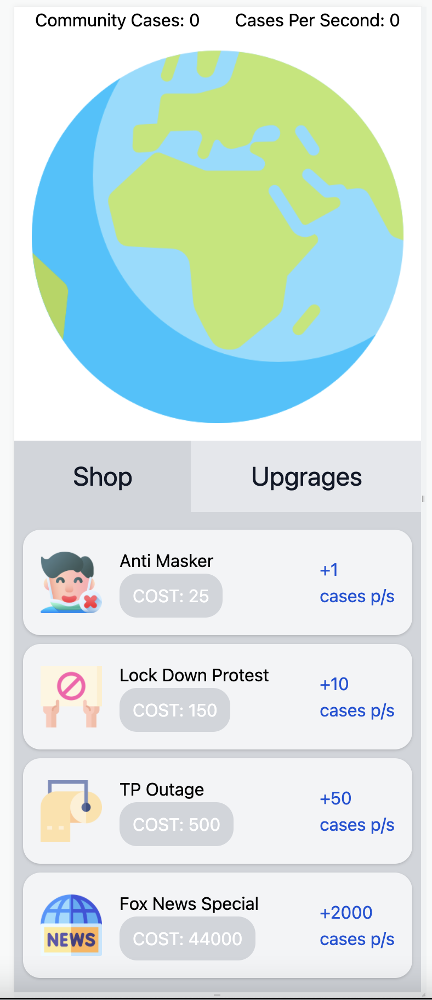
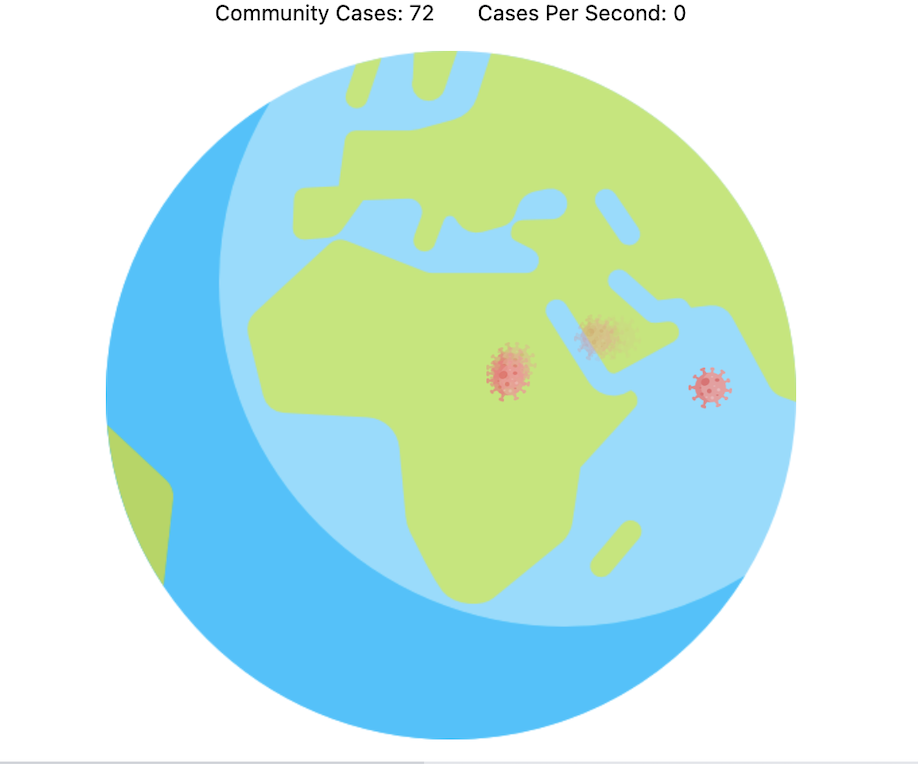

# Cookie Clicker meets Covid?

## Tldr;

If you're Gen Z, then you've probably heard of the game Cookie Clicker and played it during ICT/DIT
class. I've taken that, and used it as a base for trying out the css animation library, Animation.css.

## What was this all for?

I decided to make an idle based game because I wanted to play around with the 
[Animation.css](https://animate.style) library. I'd heard positive things about it, but hadn't 
gotten to use it yet. If you're wondering what it is, it's a library that provides utility classes
with a wide array of animations.

## The game in a nut shell

1. Arrive on the main screen and admire the neat artwork (credit someone else)
2. Click on the world to infect a person (community case)
3. Purchase spreaders in the shop which will increase the number of community cases per second.
4. Further increase the spread with upgrades like mutating the virus.

## Animating the clicks

What I wanted to do, was make clicking the world addictive. When clicking, a little covid image
appears, and floats off.

This works by
1. Clicking the world registers an on click event.
2. Event handler on the click adds a float object to an array which contains the x and y position 
   of the click.
3. Ephemeral components are created for each object in the array of floaters. These components are
   absolute positioned, with an x, y position of the click.
4. I added the animation.css classes `animate__animated animate__slow animate__fadeOutUp` which gives 
   them a fading upwards effect.
5. Every 15 seconds, I clear the array of objects so I don't have a memory leak.

## Check it out

This project is open source, you can check it out on my github. https://github.com/IsaacMurtagh/covid-clicker