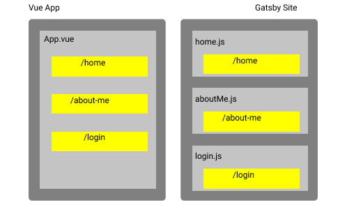

# Creating my own portfolio site

## Tldr;

I've done some projects in the past and intend on doing some more in the future. This portfolio site
I've built should give me the change to reflect on own self learnings and visibility over what things
I have worked on!

## My Motivation
I decided to create my own portfolio site after having completed a large end to end project using
serverless technology ([see here](/projects/serverless-quizzes/)). I had done two brown bag talks
about the technology so far, one on using serverless technology and another web sockets and using
Amazon's API Gateway. I didn't want the work I had done to end up in a git repo and that be the end 
of it. I also spend 10% of my time at work doing self learning, so there is bound to be more extended
projects that I'd want to showcase.

I'd like to state, this is foremost a place for me to reflect on my own self learning and to have 
visibility on the things I have done.

## Technology choices

When choosing a framework to create my project, there was two things I had decided to begin with. I 
didn't want to use a template where it's created for me already and all I do is add my posts. Secondly,
I wanted this to be an opportunity to try a framework I hadn't used before. In the past, I'd only 
created web apps with Vue.js v2. In the end I had three choices; Jekyll, React, and Gatsby. As I 
wanted to make the comparison of React and Vue, I leaned heavily towards Gatsby and React. However,
watching a YouTube video comparing the strengths of Next.js, Gatsby and React I thought that Gatsby
would be suited as I wasn't going to be changing this site very often, and there are a lot of great
tools to make a blog post.

The next technology choice I'd had to make was with the CSS styling. Firstly, I have no intention of
going vanilla and not using a framework. Secondly, I've tried a few different frameworks for projects
I've done; Vuetify, Bootstrap, Ionic, Bootstrap Md, and Tailwinds. Of the ones I've tried, Tailwinds 
has given me the best experience. I prefer the utility prefer approach that you take using the
framework. I've found that it allows you to do more powerful this and gives you a better understanding
of the css that is being used.

## Architectural Decisions

My vision for this portfolio site is to allow me to write a markdown file, upload it and not have to
do anything else. I structured the site in a way that the blog posts are declarative. I only need to
add an md file in a folder and a new route is created for it.

I've used a layout component to hold the layout of a file, so that on each page I wrap the content
so each page is consistent with the other. In Vue, where I'm coming from, it's a single page application,
so you have an entry point, App.Vue, then the routes (or pages) in your website sit inside that
component.

## Intended workflows

At this moment, I intend for there to be two types of posts I make to my portfolio. One being a 
project, where I try to create a deliverable piece of software. I'll then right up some of my findings during the project,
any decisions that I had to make, and some solutions to problems I ran into.

The other post I'll make is a blog post. This will be a post with a smaller scope, where I share my
own knowledge on a topic in the technology space.

## Open source

I hope to make most of the projects I write about here open source, so i've started with this one.
You can check out the code if you're thinking of doing something similar or just curious.
https://github.com/IsaacMurtagh/portfolio-gatsby
