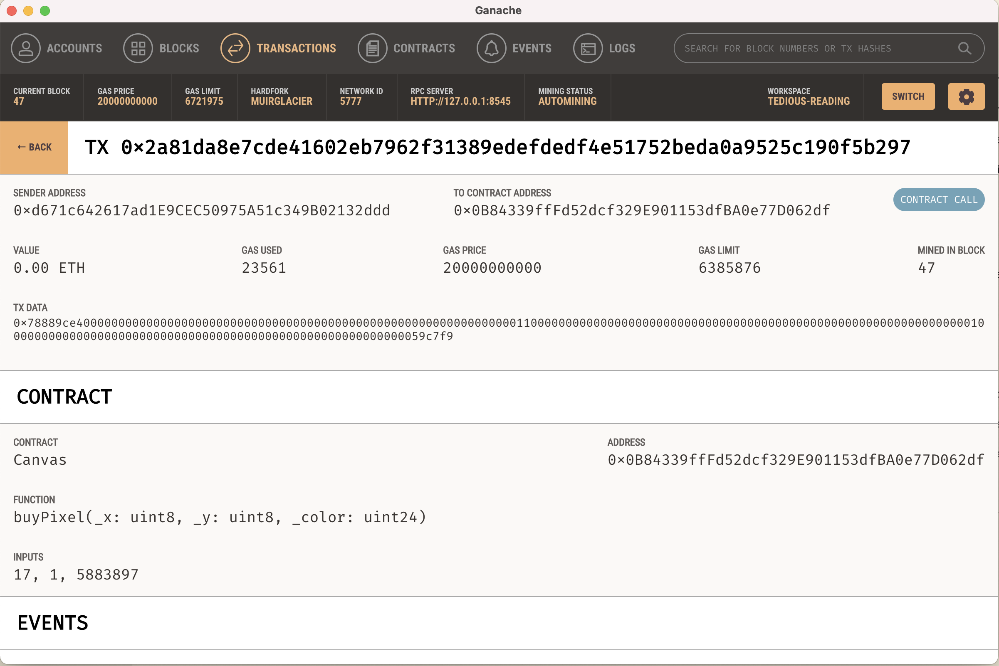
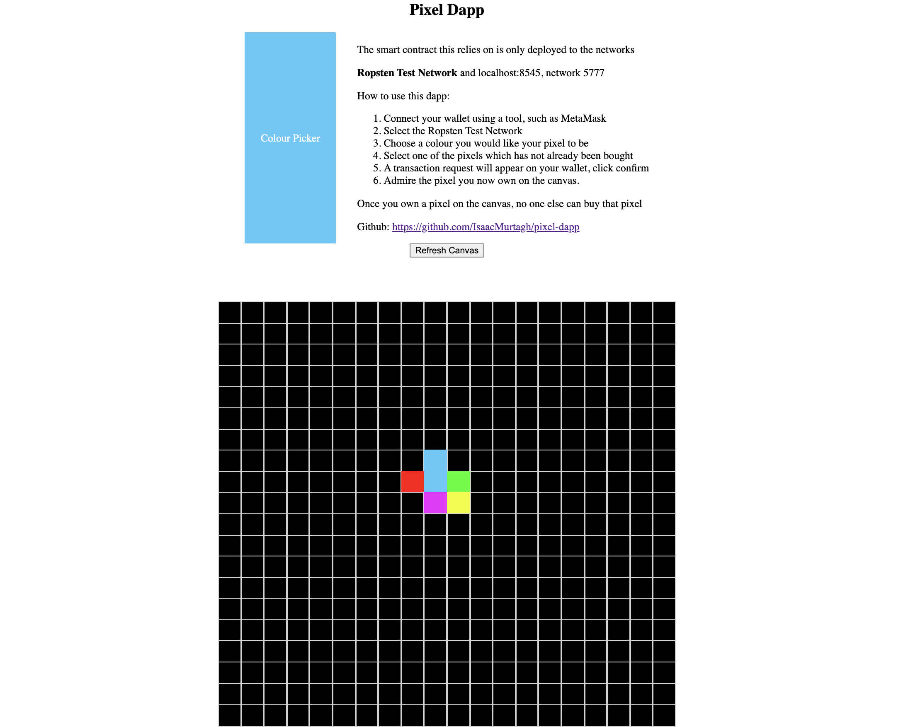

# Block chain million dollar website

## Tldr;

Have you heard of the million dollar homepage? Well I've taken that concept and used Ethereum
smart contracts to allow people to own pixels stored on the Blockchain. See it at https://isaacmurtagh.github.io/pixel-dapp

## Motivation

I've heard a lot of about Blockchain, but a most of it is around the speculation of price. I'm very
much a supporter of the technology it self, so I wanted to work on project which would motivate me to
get a better understanding of the technology and make something functional with it.

## What did I make?

I based this project off [the million dollar homepage](http://www.milliondollarhomepage.com). That is 
a site where there is 1 million pixels, and companies paid one dollar for each pixel to advertise their
brand. I decided to create a smart contract which allowed for the concept of pixels being owned by ethereum
accounts and for them to assign a colour to it.


## The smart contract

I used Solidity for the smart contract, an object oriented programming language, popular for creating 
Ethereum smart contracts. To learn the basics I did a Udemy course of the language and completed
some of the projects they recommended.

The framework I used to compile and deploy the smart contracts was truffle.

There is a single contract which I named a canvas. This canvas contained an array of arrays to form a
matrix. The matrix elements contained a single struct called a pixel. These pixels had an address, the
owner and hex colour assigned by the purchaser. The canvas also had a constant price for each pixel.

Querying with the canvas you could query for pixel based on the x, y coordinate. The returned pixel
would indicate if there was an owner and the colour of the pixel, which by default was the hex colour
#000000.

To make a purchase for a pixel you would pay a smart contract called `buyPixel`. You would also supply
the x, y and colour of the pixel. If no one owned the pixel and you paid the exact amount then
the transaction would be successful and you would be the immutable owner of that pixel.

```
// SPDX-License-Identifier: MIT
pragma solidity ^0.8.1;

contract Canvas {

  struct S_Pixel {
    uint24 color;
    address owner;
  }

  S_Pixel[20][20] public pixels;
  uint public startingPriceWei = 1 gwei;

  event PixelBought(uint8 _x, uint8 _y, uint24 _color);
  
  function buyPixel(uint8 _x, uint8 _y, uint24 _color) public payable {
      require(pixels[_x][_y].owner == address(0), 'Pixel already owned');
      require(msg.value == startingPriceWei, 'Pixel must be payed in full');
      pixels[_x][_y].color = _color;
      pixels[_x][_y].owner = msg.sender;
      emit PixelBought(_x, _y, _color);
  }

  function getRow(uint _row) public view returns(S_Pixel[20] memory) {
    return pixels[_row];
  }
}
```

## Testing the smart contract

If you're familiar with Blockchain then you probably know Ethereum transaction prices are extremely pricey ($70 min as of writing this).
It's important when developing any software that you have a fast feedback loop. I used ganache to test
the contract locally. You can deploy contracts with truffle on it's own local test network, but ganache
offers persistence after shutting down and a nice UI which helped me understand what was being sent
in transactions.



## Deploying the smart contract

Instead of wasting hundreds of dollars and deploying the application to the ethereum mainnet, I only
deployed the app to the Ropsten test network. If you're unfamiliar with this, it's like the main network
but the ether has no value. You can go to a faucet and get free ethereum to test out smart contracts.

I then created a ropsten infura project, deployed my application and now anyone (including you) can go
and buy a pixel on my canvas.

## Creating the Dapp UI

Using Vue3, I created an application that connects to smart contract.

My contract after deploying outputs an Application Binary Interface (ABI). The ABI allows your application
to know the contract's address on the Blockchain and the methods available to call. I used Web3.js to
call these much like a typical API.

When the app starts it would request access to your meta mask. It then uses this to call for the smart
contract based on the network you're connected to (only deployed to my ropsten). If it can find the smart
contract, it will then lookup the rows of pixel and show the canvas on the page.



You can then click on an un owned pixel, the UI will trigger an transaction and using your wallet of
choice you may pay the piper. Vuala, you are now the proud owner of a pixel of my rendition of a 
Blockchain million dollar homepage.

## Limitations

You may notice that the canvas is only a 20x20 matrix, not 1000 x 1000 for a million pixels. That's
because I ran into an issue of the querying for all the pixels. There was no easy way to return all
all of them at once. There appears to be a memory issue when trying to return an array of arrays or an
array of 1000 structures.

## Resources
Code: https://github.com/IsaacMurtagh/pixel-dapp