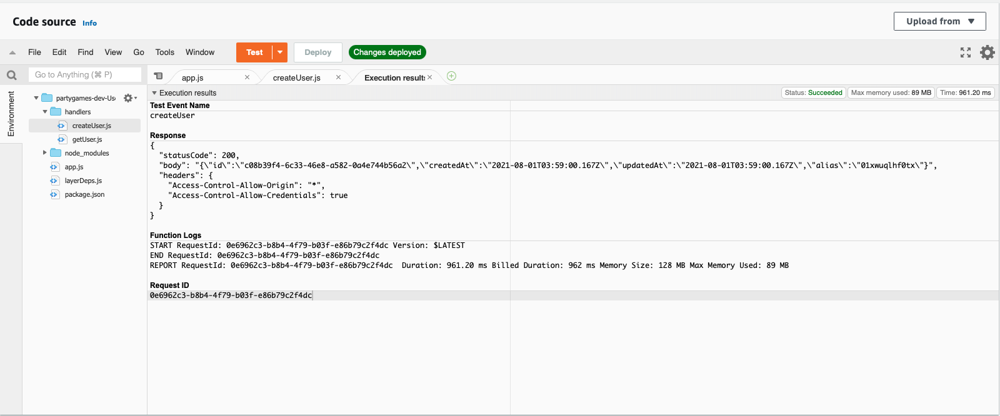

# Serverless multi-choice quiz API!

## Tldr;

I used AWS to create a serverless API for multi choice quizzes you can play with your friends.
Using Amazons Lambda and API Gateway, players of the game are able to share a link with their friends,
establish a web socket connection to my backend and have new rounds broadcasted to them in real
time! You can check out my final web app at [https://isaacmurtagh.github.io/PartyGames_Client/](https://isaacmurtagh.github.io/PartyGames_Client/)

## The Beginnings

This project began when I decided that I wanted to learn about deploying a service completely 
serverless. I wanted to create something in my free time, but didn't want to be paying any money. 
Because amazons pricing for Api Gateway and Lambda was only pay for what you use, I thought this 
would be a perfect fit.

When I first started this project, I knew I wanted to make something with game state. This was going
to be give me the best opportunity to use different technologies and expand on my knowledge base.

Choosing a serverless framework, I found two popular choices. The **Serverless Framework** which 
appears to have be first on the scene, and Amazons own **SAM** (Serverless Application Model) 
framework. I preferred sam, as it was native to Amazon, and the only costs were what was hosted in
the cloud.

## Backend

### Getting Started

Like you always should when you create your first project with a new technology, I created my Hello
World. This was relatively straight forward with the `sam init` command. Something that originally
appealed to me about SAM was that it allowed me to test my functions locally by mocking api gateway.
I was able to test my Hello World, but i wasn't satisfied. Hello Worlds are easy, the real getting
started is do have a base for the project you want to work on.

I followed the Amazon docs, and created myself a very simple Rest Api. You would GET /health and
be returned with 200, OK. SAM has a template file which is an abstraction over amazons Cloudformation
file. It allows you to describe a service in fewer lines, and then sam interprets it and uploads
the template file that Cloudformation understands. Once I built and deployed the code, Api Gateway
created me a URL and I was able to invoke my lambda function which handled the request.

This is a snippet of what I had to define for provisioning my cloud resources

```
# template.yaml
...
Resources:
  GameFunction:
    Type: AWS::Serverless::Function
    Properties:
      CodeUri: src/hello-world
      Handler: app.handler
      Events:
        GetHealthApi:
          Type: Api
          Properties:
            Path: /health
            Method: get
Outputs:
  Api:
    Description: "API Gateway endpoint URL"
    Value: !Sub "https://${RestApiGateway}.execute-api.${AWS::Region}.amazonaws.com/api"
```

### Implementing my first APIs

My next goal was to be able to /GET Game and /POST Game. For this I going to need the APIs and a
database for persisting the games. 

When choosing my database I wanted free, managed and NoSql. As I'm already using AWS for my cloud
services, I decided on Dynamo DB.

The great thing about serverless applications is you can tear things down and spin them back up 
so easily and quickly. I decided that a development and production environment best let me utilise a 
workflow of tearing down the Api and spinning it back up as much as I want. I did this by declaring
different parameters passed into my template.yaml file, which would create me a dev or prod
database depending on the mode. Then I would map the database name depending on my environment 
inside the template.yaml file.
```
Mappings:
  EnvironmentMap:
    dev:
      gamesTable: games-dev
    prod:
      gamesTable: games-prod
Globals:
  Function:
    Environment:
      Variables:
          GAMES_TABLE_NAME: !FindInMap [ EnvironmentMap, !Ref "Environment", gamesTable ]
```

At this point of the project my directory structure was looking something like this.
```
├── README.md
├── docker-compose.yml           <--- Start dynamo locally
├── samconfig.toml               <--- Sam cli configs
├── src
│   └── game                     <--- Deployed to Lambda
│       ├── app.js               <--- Lambda entry point
│       ├── dbClient.js
│       ├── gamesTable.js
│       ├── handlers
│       │   ├── createGame.js    <--- Handle /POST
│       │   └── getGame.js       <--- Handle /GET
│       ├── models
│       │   └── Game.js
│       └── package.json
└── template.yaml                <--- Cloud formation
```

However, I was already starting to see a problem with scaling a serverless application I would need
to solve next.

### Sharing code between Lambdas

I knew that I wanted to separate my Lambdas based on the resource concern for my APIs but it was 
natural that some resources needed to know about other resources. I was going to have a user model, 
but any call to create or join a game would need to check the user who was making the request. 

After some looking into how I might define models of games and users in each lambda without rewriting
the class, I found Lambda Layers. These would allow me to deploy code to AWS Lambda which could
be used by other lambdas. This solved the problem of declaring dependencies in each of my layers
package.json files, needing a db client for each of my layers, and reusing models.

When using layers, to access to files stored in them from your layer deploy to AWS you require from
the `/opt/nodejs/{file-path}`. This poses a problem when you want to test your application locally.
To solve this, you would need to conditionally require from the directory in your local machine or
the location in AWS.
```
const gamesTable = inAws ? require('/opt/nodejs/tables/gamesTable') : require('../_layers/common/tables/gamesTable');
```
This can get messy quick. So i opted to do this sort of logic in a single file called `layerDeps.js`.
This abstracted away the logic of knowing what environment I was in, and the locations of the files.
```
# src/game/layerDeps.js
const inAws = !!process.env.AWS_REGION;
const gamesTable = inAws ? require('/opt/nodejs/tables/gamesTable') : require('../_layers/common/tables/gamesTable');
module.exports = { gamesTable };

# src/game/handlers/createGame.js
const { gamesTable } = require('../layerDeps.js')
```
Another approach might be to have a config which gave a base path of the file. This has the benefit
being more specific about what files you need, but with the trade off of more lines of code.
```
# src/game/handlers/createGame.js
const { COMMON_LAYER_BASE_PATH } = require('../configs');
const gamesTable = require(`${COMMON_LAYER_BASE_PATH}/tables/gamesTable`);
```

### Feedback loop go ZOOM!
When starting with serverless, you might run into calling your endpoint and getting back 500's,
without knowing exactly why. If the lambda does not handle the exception then it won't return anything
and will always time out. I spent of my time early running into these sorts of issues and learned two
things that really started to speed up my feedback loop.

Firstly, don't be afraid to debug inside the Lambda itself. The AWS Console for Lambda provides
an IDE, a way to run test events against your lambda and a one click deploy within seconds that will
allow you to rapidly comment out code and insert logging to narrow down the cause.


Secondly, you can greatly improve your workflow by having feature tests. You can mock the request
given to function from the API Gateway by calling the function with a body with same key names.
Then, using `jest-dynamodb` you can intercept the calls made to dynamoDb so you don't need to run
a docker container. I also used `aws-sdk-mock` and `Sinon.js`  when I was calling their APIs to send 
messages to my websocket connections. Here is a snippet of one my tests.
```
it('User has already made a connection with a game returns 403', async () => {
  const spy = sinon.spy();
  AwsMock.mock('ApiGatewayManagementApi', 'postToConnection', (params, callback) =>  {
    spy(JSON.parse(params.Data));
    callback();
  });
  const creatorResponse = await steps.createAUser();
  const userId = creatorResponse.body.id;
  const gameResponse = await steps.createAGame({ 
    userId,
    name: 'Pokemon Lobby',
    type: 'WouldYouRather',
  });
  const gameId = gameResponse.body.id;

  await steps.connectToWss({ gameId, userId, connectionId: uuid() });
  const connectResponse = await steps.connectToWss({ gameId, userId, connectionId: uuid() });

  expect(spy.notCalled).toBeTruthy();
  expect(connectResponse).toEqual({
    statusCode: 403,
    body: { message: 'CONNECTION_ALREADY_ESTABLISHED' }
  });
  AwsMock.restore();
});
```
I'd recommend using cucumber if you're going to write feature tests. I didn't think this project
was going to get very large, so I didn't invest the time to adding it and created my own testings
framework.

### Web Sockets
As I became more confident with the serverless technology I wanted to do something more challenging 
with it. I decided I'd make use of the Web socket gateway and try to implement some sort of real
time quiz game. I'd want a user to be able to create a game, share that game through a URL and then
play social quiz games, like what music do you rather listening to.

When using Amazons web sockets, different routes are used to determine what to invoke. For example,
I have a lambda function called onConnect which takes query string parameters attached to the web 
socket URL, adds the connection to a connections database, and then broadcasts to all connections also
apart of that game that a new player has joined. This lambda is invoked when the $connect route is 
called by connecting to the web socket. I also ended up with a $disconnect route and function which
handled the cleanup of the resources.

I was implementing a time based round game, which meant I needed to handle calling a function every
~10 seconds which broadcasted the new round to all participants of a game. I could either find a
service that would call an endpoint every few seconds which would trigger the new round, or I could
do it in one Lambda function which did a setTimeout between each call. I opted for the latter because
after some analysis I found that AWS is so cheap, that even if each game ran for a minute, it
would still only cost me $1 for every 10,000 games. Even if that is an inefficient use of resources
it is still cheaper than paying for another service and the invocations to a new lambda for each round.

Here's a code snippet of my lambda broadcasting a new round every few seconds.
```
async function sendRounds({ game, event}) {
  const socketManager = new SocketManager(event.requestContext);
  let i = 0;
  while (i < game.numberRounds) {
    i++;
    await Promise.all([
      newRound({ gameId: game.id, socketManager, roundNumber: i }),
      timeout(game.roundTimeMs)
    ]);
  }
  return;
}
````

## Resources
Find the code to the frontend and backend on my github  
* https://github.com/IsaacMurtagh/PartyGames_Client
* https://github.com/IsaacMurtagh/PartyGames_Server